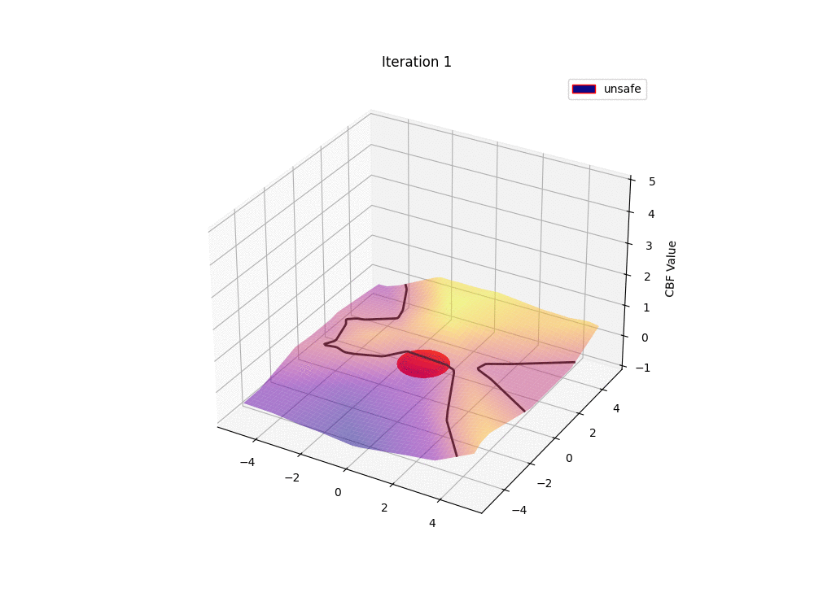

<h1 align="center">
FoSRL: A Tool for Formally-Guaranteed Safe Reinforcement Learning
</h1>

<p align="center">
<a href="https://opensource.org/license/bsd-3-clause/"></a>
<a href="https://python.org"></a>
<a href="https://github.com/luigiberducci-research/fosrl/actions/workflows/tests_on_push.yml/badge.svg"></a>
<a href="https://github.com/luigiberducci-research/fosrl/actions/workflows/linting_on_push.yml/badge.svg"></a>
<a href="https://github.com/psf/black"></a>
</p>


**Learning framework** for Safe Reinforcement Learning with Control Barrier Functions (**CBFs**) 
for control-affine systems.

We combine **counterexample-guided pretraining** and **RL algorithms** to
learn a policy which is guaranteed to be safe to a set of environmental assumptions.



## :wrench: Installation 
The code is written in Python 3.10 and uses [PyTorch](https://pytorch.org/) for
learning a CBF.
We recommend using a virtual environment.

To install the required dependencies, run
```bash
pip install -r requirements.txt
```

## :rocket: Getting Started
We provide some examples and notebooks to get started with the codebase.

Currently, we provide the following examples in the `examples` folder:
- `tutorial_hello_world`: an example to use FoSRL on a 2d environment with linear dynamics. 
We show how to learn a valid CBF and conduct safe policy optimization.
- `tutorial_uncertainty`: an example to use FoSRL with uncertain dynamics.
We show how to learn a valid Robust CBF and conduct safe policy optimization under non-deterministic noise.


### :warning: Disclaimer
This is a research prototype, which builds on prior work on Lyapunov functions ([FOSSIL](https://github.com/oxford-oxcav/fossil)).
Here, we focus on support for CBF and Robust CBF and their adoption in reinforcement learning.


# Known issues
We collect some of the issues that we have encountered during the development of this project.
These are not strictly related to FoSRL but rather installation and compatibility issues. 
However, we think it might be useful for users who encounter similar issues.

1. Rendering in Mujoco env
If when using mujoco environments, you run into the following error
```
mujoco.FatalError: gladLoadGL error
```
Please have a look at [rendering in mujoco](https://pytorch.org/rl/reference/generated/knowledge_base/MUJOCO_INSTALLATION.html)
Ensure dependencies are there and env variables.
For ubuntu 20.04 install: 

`sudo apt-get install libglfw3 libglew2.1 libgl1-mesa-glx libosmesa6`


2. Video recording with Moviepy.
```
TypeError: must be real number, not NoneType
```
Solved by reinstalling moviepy and decorator packages
and reinstalling moviepy.
```
pip uninstall moviepy decorator
pip install moviepy
```
